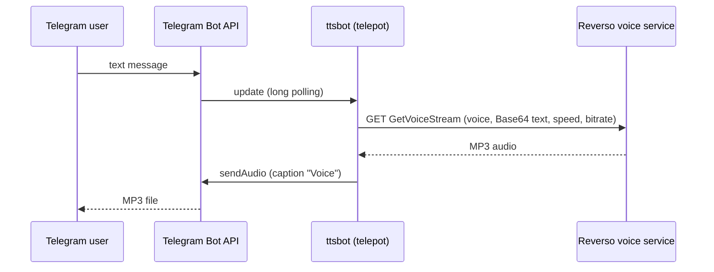

*Please :star: this repo if you find it useful*

<p align="left"><br>
<a href="https://www.paypal.com/paypalme/techblogil?locale.x=he_IL" target="_blank">Support this project on PayPal</a>
</p>


# ttsbot

ttsbot is a small, self-hosted Telegram bot that converts text to speech. Send it any text
message and it replies with an MP3 file of that text read aloud by one of the
[Reverso](https://www.reverso.net) text-to-speech voices. It is written in Python, uses the
[Telepot](https://telepot.readthedocs.io/en/latest/) Telegram library and the
[pyttsreverso](https://github.com/rt400/pyttsreverso) wrapper, and ships as a Docker image.

> **Status and limitations — please read before deploying**
>
> - **Telepot is unmaintained.** Its GitHub repository is archived and the last PyPI release
>   (12.7) dates from 2018. It does not support newer Telegram Bot API features, and it may
>   stop working if Telegram changes the API.
> - **Reverso's text-to-speech endpoint is unofficial and undocumented.** The bot calls it
>   through pyttsreverso (last updated in 2021). The endpoint, its parameters or the voice
>   list may have changed or been removed since this project was written, so the bot may no
>   longer produce audio. <!-- TODO: verify that the Reverso voice endpoint still works -->
> - The published Docker image was last pushed in July 2020 and the Dockerfile is based on
>   Ubuntu 18.04, which is past the end of its standard support.
>
> Treat this project as a working example rather than a maintained service.

## Table of contents

- [Features](#features)
- [How it works](#how-it-works)
- [Requirements](#requirements)
- [Installation](#installation)
- [Configuration](#configuration)
- [Supported voices](#supported-voices)
- [Usage](#usage)
- [Security and privacy notes](#security-and-privacy-notes)
- [Troubleshooting](#troubleshooting)
- [Development](#development)
- [Credits](#credits)
- [Disclaimer](#disclaimer)
- [Contributing](#contributing)
- [License](#license)

## Features

- Replies to every text message with an MP3 file of the text spoken aloud.
- 89 Reverso voices across more than 30 languages and regional variants (see
  [Supported voices](#supported-voices)).
- Voice, speed and MP3 bitrate set through environment variables.
- A single Python script with no database or state; runs in one Docker container.

## How it works



1. The bot connects to Telegram with telepot's `MessageLoop` (long polling, so no public URL or
   webhook is needed).
2. For each incoming message, it passes the message text to `pyttsreverso.ReversoTTS().convert_text()`.
3. pyttsreverso Base64-encodes the text and sends an HTTP `GET` request to Reverso's unofficial
   endpoint `https://voice.reverso.net/RestPronunciation.svc/v1/output=json/GetVoiceStream/…`
   with the voice name in the path and the Base64 text, speed and bitrate as query parameters.
4. The returned audio is saved to a temporary `.mp3` file in the working directory, named after
   the first three words of the message.
5. The file is sent back to the same chat with `sendAudio` (caption `Voice`) and then deleted.

## Requirements

- A Telegram bot token. Create a bot with [@BotFather](https://t.me/BotFather); see
  [Bots: An introduction for developers](https://core.telegram.org/bots).
- Outbound internet access to `api.telegram.org` and `voice.reverso.net`.
- Docker (with Docker Compose), **or** Python 3 with `pip` to run the script directly.

## Installation

### Docker Compose (image from Docker Hub)

The image is published as [`techblog/ttsbot`](https://hub.docker.com/r/techblog/ttsbot). Only
the `latest` tag exists, and it is built for `linux/amd64` only.

This is the repository's [`docker-compose.yml`](docker-compose.yml):

```yaml
version: "3.7"

services:
  ttsbot:
    image: techblog/ttsbot
    #build: https://github.com/t0mer/ttsbot.git
    container_name: ttsbot
    restart: always
    labels:
      - "com.ouroboros.enable=true"
    environment:
      - BOT_API_KEY=
      - TTS_LANG=he-IL-Asaf-Hebrew
      - TTS_PITCH=100
      - TTS_BITRATE=128k
      - PYTHONIOENCODING=utf-8
      - LANG=C.UTF-8
```

The file sets `- BOT_API_KEY=` explicitly (empty), so a `.env` file next to it is **not** used
for the token as-is. To keep the token out of the compose file, change that line to read it
from your shell or a `.env` file:

```yaml
    environment:
      - BOT_API_KEY=${BOT_API_KEY}
```

or remove the `BOT_API_KEY` entry and load it from a separate file:

```yaml
    env_file: .env        # contains BOT_API_KEY=<your-bot-token>
```

Choose a voice for `TTS_LANG`, then start it:

```bash
docker compose up -d
docker logs -f ttsbot
```

The script prints `I am listening ...` unconditionally at startup, before it has contacted
Telegram, so that line does not mean the bot is connected. Because `PYTHONUNBUFFERED` is not
set, the line may not appear in `docker logs` at all. Telegram errors (for example a bad token)
show up as Python tracebacks on stderr.

The `com.ouroboros.enable=true` label lets [Ouroboros](https://github.com/pyouroboros/ouroboros)
update the container automatically if you run it; it has no effect otherwise.

### Docker run

```bash
docker run -d --name ttsbot --restart always \
  -e BOT_API_KEY="<your-bot-token>" \
  -e TTS_LANG="Sharon-US-English" \
  -e TTS_PITCH="100" \
  -e TTS_BITRATE="128k" \
  techblog/ttsbot
```

### Build the image yourself

```bash
git clone https://github.com/t0mer/ttsbot.git
cd ttsbot
docker build -t ttsbot .
```

Or uncomment the `build:` line in `docker-compose.yml` (and remove `image:`) to let Compose
build from the GitHub repository.

The Dockerfile uses `ubuntu:18.04`, installs `python3-pip`, and installs `telepot`, `requests`
and `pyttsreverso` with `pip3` (unpinned, so the latest available versions are used). The
container runs `python3 /opt/ttsbot/ttsbot.py`.

### Run without Docker

```bash
pip3 install telepot requests pyttsreverso
export BOT_API_KEY="<your-bot-token>"
export TTS_LANG="Sharon-US-English"
export TTS_PITCH="100"
export TTS_BITRATE="128k"
python3 ttsbot.py
```

## Configuration

All settings are environment variables. The script itself has **no built-in defaults**: it reads
each variable with `os.getenv()` and passes the value straight through.

| Variable | Required | Example (compose) | Description |
|---|---|---|---|
| `BOT_API_KEY` | Yes | `<your-bot-token>` | Telegram bot token from @BotFather. |
| `TTS_LANG` | Recommended | `he-IL-Asaf-Hebrew` | Voice to use: a value from the **LangCode** column in [Supported voices](#supported-voices). If unset or empty, pyttsreverso falls back to Sharon (US English). An unknown value makes every conversion fail. |
| `TTS_PITCH` | Recommended | `100` | Despite its name, this is sent to Reverso as the **voice speed** (`voiceSpeed`) parameter; `100` is normal speed. |
| `TTS_BITRATE` | Recommended | `128k` | MP3 bitrate sent to Reverso (`mp3BitRate`). |
| `PYTHONIOENCODING` | No | `utf-8` | Set in the Dockerfile and compose file so non-ASCII text prints correctly. |
| `LANG` | No | `C.UTF-8` | Set in the Dockerfile and compose file for a UTF-8 locale. |

**Always set `TTS_LANG`, `TTS_PITCH` and `TTS_BITRATE` explicitly.** The Dockerfile tries to
set defaults (`Sharon-US-English`, `100`, `128k`), but it writes them as `ENV TTS_LANG = "…"`
with spaces around `=`. Docker parses that as the legacy `ENV key value` form, so the
value includes the leading `= `. The published image's config confirms the effective values:
`TTS_LANG="= Sharon-US-English"`, `TTS_PITCH="= 100"` and `TTS_BITRATE="= 128k"`. All three
are broken (an invalid voice name, speed and bitrate) unless your compose file or
`docker run` command overrides them.
If `TTS_PITCH` or `TTS_BITRATE` is not set at all, the literal string `None` is sent to Reverso.

The voice, speed and bitrate apply to all chats. There are no per-user settings and no bot
commands to change them.

## Supported voices

Set `TTS_LANG` to a value from the **LangCode** column. This list matches the `VoiceName` table in
[pyttsreverso](https://github.com/rt400/pyttsreverso). Reverso may have removed or renamed voices
since then. <!-- TODO: verify the voices still exist on Reverso -->

| LangCode | Voice | Gender | Language |
| ------------- | ------------- | ------------- | ------------- |
| Leila-Arabic | Leila22k | Female | Arabic |
| Mehdi-Arabic | Mehdi22k | Male | Arabic |
| Nizar-Arabic | Nizar22k | Male | Arabic |
| Salma-Arabic | Salma22k | Female | Arabic |
| Lisa-Australian-English | Lisa22k | Female | Australian English |
| Tyler-Australian-English | Tyler22k | Male | Australian English |
| Jeroen-Belgian-Dutch | Jeroen22k | Male | Belgian Dutch |
| Sofie-Belgian-Dutch | Sofie22k | Female | Belgian Dutch |
| Zoe-Belgian-Dutch | Zoe22k | Female | Belgian Dutch |
| Alice-BE-Belgian-French | Alice-BE22k | Female | Belgian French |
| Anais-BE-Belgian-French | Anais-BE22k | Female | Belgian French |
| Antoine-BE-Belgian-French | Antoine-BE22k | Male | Belgian French |
| Bruno-BE-Belgian-French | Bruno-BE22k | Male | Belgian French |
| Claire-BE-Belgian-French | Claire-BE22k | Female | Belgian French |
| Julie-BE-Belgian-French | Julie-BE22k | Female | Belgian French |
| Justine-Belgian-French | Justine22k | Female | Belgian French |
| Manon-BE-Belgian-French | Manon-BE22k | Female | Belgian French |
| Margaux-BE-Belgian-French | Margaux-BE22k | Female | Belgian French |
| Marcia-Brazilian | Marcia22k | Female | Brazilian |
| Graham-British | Graham22k | Male | British |
| Lucy-British | Lucy22k | Female | British |
| Peter-British | Peter22k | Male | British |
| QueenElizabeth-British | QueenElizabeth22k | Female | British |
| Rachel-British | Rachel22k | Female | British |
| Louise-Canadian-French | Louise22k | Female | Canadian French |
| Laia-Catalan | Laia22k | Female | Catalan |
| Eliska-Czech | Eliska22k | Female | Czech |
| Mette-Danish | Mette22k | Female | Danish |
| Rasmus-Danish | Rasmus22k | Male | Danish |
| Daan-Dutch | Daan22k | Male | Dutch |
| Femke-Dutch | Femke22k | Female | Dutch |
| Jasmijn-Dutch | Jasmijn22k | Female | Dutch |
| Max-Dutch | Max22k | Male | Dutch |
| Samuel-Finland-Swedish | Samuel22k | Male | Finland Swedish |
| Sanna-Finnish | Sanna22k | Female | Finnish |
| Alice-French | Alice22k | Female | French |
| Anais-French | Anais22k | Female | French |
| Antoine-French | Antoine22k | Male | French |
| Bruno-French | Bruno22k | Male | French |
| Claire-French | Claire22k | Female | French |
| Julie-French | Julie22k | Female | French |
| Manon-French | Manon22k | Female | French |
| Margaux-French | Margaux22k | Female | French |
| Andreas-German | Andreas22k | Male | German |
| Claudia-German | Claudia22k | Female | German |
| Julia-German | Julia22k | Female | German |
| Klaus-German | Klaus22k | Male | German |
| Sarah-German | Sarah22k | Female | German |
| Kal-Gothenburg-Swedish | Kal22k | Male | Gothenburg Swedish |
| Dimitris-Greek | Dimitris22k | Male | Greek |
| he-IL-Asaf-Hebrew | he-IL-Asaf | Male | Hebrew |
| Deepa-Indian-English | Deepa22k | Female | Indian English |
| Chiara-Italian | Chiara22k | Female | Italian |
| Fabiana-Italian | Fabiana22k | Female | Italian |
| Vittorio-Italian | Vittorio22k | Male | Italian |
| Sakura-Japanese | Sakura22k | Female | Japanese |
| Minji-Korean | Minji22k | Female | Korean |
| Lulu-Mandarin-Chinese | Lulu22k | Female | Mandarin Chinese |
| Bente-Norwegian | Bente22k | Female | Norwegian |
| Kari-Norwegian | Kari22k | Female | Norwegian |
| Olav-Norwegian | Olav22k | Male | Norwegian |
| Ania-Polish | Ania22k | Female | Polish |
| Monika-Polish | Monika22k | Female | Polish |
| Celia-Portuguese | Celia22k | Female | Portuguese |
| ro-RO-Andrei-Romanian | ro-RO-Andrei | Male | Romanian |
| Alyona-Russian | Alyona22k | Female | Russian |
| Mia-Scanian | Mia22k | Female | Scanian |
| Antonio-Spanish | Antonio22k | Male | Spanish |
| Ines-Spanish | Ines22k | Female | Spanish |
| Maria-Spanish | Maria22k | Female | Spanish |
| Elin-Swedish | Elin22k | Female | Swedish |
| Emil-Swedish | Emil22k | Male | Swedish |
| Emma-Swedish | Emma22k | Female | Swedish |
| Erik-Swedish | Erik22k | Male | Swedish |
| Ipek-Turkish | Ipek22k | Female | Turkish |
| Heather-US-English | Heather22k | Female | US English |
| Karen-US-English | Karen22k | Female | US English |
| Kenny-US-English | Kenny22k | Male | US English |
| Laura-US-English | Laura22k | Female | US English |
| Micah-US-English | Micah22k | Male | US English |
| Nelly-US-English | Nelly22k | Female | US English |
| Rod-US-English | Rod22k | Male | US English |
| Ryan-US-English | Ryan22k | Male | US English |
| Saul-US-English | Saul22k | Male | US English |
| Sharon-US-English | Sharon22k | Female | US English |
| Tracy-US-English | Tracy22k | Female | US English |
| Will-US-English | Will22k | Male | US English |
| Rodrigo-US-Spanish | Rodrigo22k | Male | US Spanish |
| Rosa-US-Spanish | Rosa22k | Female | US Spanish |

pyttsreverso's own default voice is `Sharon-US-English`. The repository's `docker-compose.yml`
uses `he-IL-Asaf-Hebrew`.

## Usage

1. Start the bot (see [Installation](#installation)).
2. Open a chat with your bot in Telegram and send it any text.
3. The bot replies with an MP3 file of the text, captioned `Voice`.

Notes on behavior (from the code):

- **There are no commands.** Every text message, including `/start`, is converted to speech as-is.
- Only text messages are handled. Stickers, photos, voice notes and other non-text messages
  raise an error in the handler and get no reply.
- The voice is fixed by `TTS_LANG`; the bot does not detect the language of the message, so
  write in the language of the chosen voice.
- The text is sent to Reverso Base64-encoded in the URL, so very long messages may fail.
  <!-- TODO: verify Reverso's maximum text length -->

## Security and privacy notes

- **There is no access control.** The bot answers anyone who finds it, and in groups it
  answers every text message it can see. Keep the bot's username private, or add your own
  allowlist if that matters to you.
- **Everything users send is forwarded to a third party** (Reverso) to generate the audio.
  Don't use the bot for sensitive text.
- **Keep your bot token secret.** Pass it through an environment variable or a local `.env` file (with `- BOT_API_KEY=${BOT_API_KEY}` or `env_file: .env` in compose, as shown in [Installation](#installation)).
  Don't put it in a committed `docker-compose.yml` or in a README. If a token was ever
  committed, revoke it with @BotFather (`/revoke`) and generate a new one.
- The container runs as root on an Ubuntu 18.04 base with unpinned Python packages. Prefer
  building the image yourself over running an old public image.

## Troubleshooting

| Symptom | Likely cause |
|---|---|
| The bot never responds, and `docker logs ttsbot` shows repeated Python tracebacks from Telegram requests (stderr) | `BOT_API_KEY` is missing or invalid. The script does not check it at startup, and its `I am listening ...` message is printed regardless (and may not appear at all, since output is buffered). |
| The bot is online but never replies, with a `KeyError` in `docker logs ttsbot` | `TTS_LANG` is not an exact LangCode from the table (check spelling and case). This also happens if you rely on the Dockerfile's default (see [Configuration](#configuration)). |
| A `TypeError` in the logs and no reply | The request to Reverso failed (network error); pyttsreverso returns the error as text, which the bot cannot write as audio. |
| The bot replies with a file that doesn't play | Reverso returned an error page instead of audio. Its unofficial endpoint may have changed. |
| No reply to messages containing a `/` (other than a single leading one) in their first three words | The temporary file name is built from the first three words, and a `/` makes it an invalid path. |

## Development

The whole bot is [`ttsbot.py`](ttsbot.py) (about 50 lines):

| File | Purpose |
|---|---|
| `ttsbot.py` | The bot: reads the environment variables, runs the telepot `MessageLoop`, converts each message with pyttsreverso and sends the MP3 back. |
| `Dockerfile` | Ubuntu 18.04 image that installs the Python dependencies and runs the script. |
| `docker-compose.yml` | Example deployment using the `techblog/ttsbot` image. |
| `License` | Apache License 2.0. |

There are no tests, no CI workflows and no GitHub releases. The Docker Hub image was pushed
manually. <!-- TODO: verify how the Docker Hub image was built -->

## Credits

- [Reverso](https://www.reverso.net) for the text-to-speech voices.
- [Yuval Mejahez](https://github.com/rt400) for creating [pyttsreverso](https://github.com/rt400/pyttsreverso).
- [Telepot](https://github.com/nickoala/telepot) for the Telegram Bot API client.

## Disclaimer

This project is not affiliated with, endorsed by or sponsored by Reverso or Telegram.
It uses an unofficial, undocumented Reverso endpoint through a third-party library. That
endpoint may change or stop working at any time, and using it may violate Reverso's terms of
service. You are responsible for checking the terms and using the bot accordingly.

## Contributing

Issues and pull requests are welcome. Keep changes small and describe how you tested them
against a real bot token.

## License

This project is licensed under the [Apache License 2.0](License).
